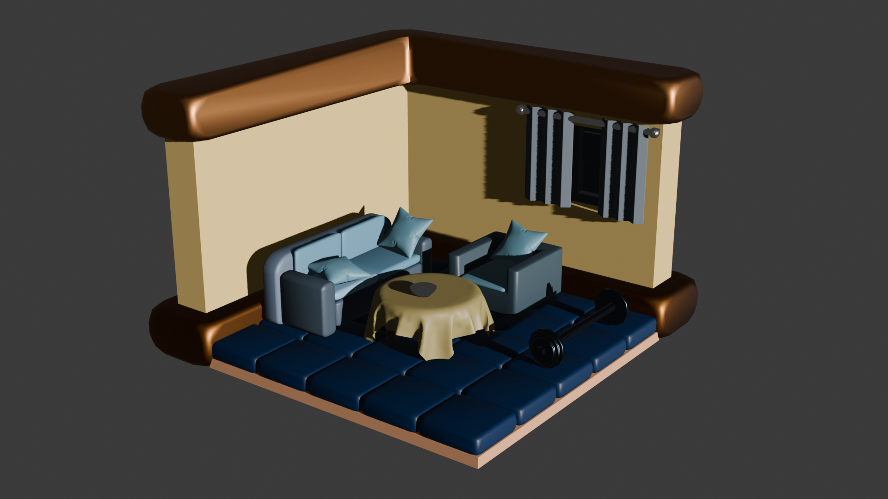

# 3D İzometrik Oda Tasarımı

TNC Group 3D eğitim programı kapsamında geliştirilen, izometrik kamera açısına sahip oda tasarımı projesi.

## Proje Hakkında
Bu proje, 3D modelleme temel yetkinliklerini geliştirmek amacıyla oluşturulmuştur. Odadaki tüm mobilyalar ve yapısal elemanlar; modern 3D modelleme teknikleri, modifier kullanımı ve ışıklandırma prensipleri uygulanarak tasarlanmıştır.

## Kullanılan Teknikler & Araçlar
- **Modelleme:** Bevel, Solidify, Array ve Subdivision Surface modifierları.
- **Işıklandırma:** Sun Light (Doğal aydınlatma) ve Area Light (Pencere detay aydınlatması).
- **Kamera:** İzometrik görünüm için Orthographic kamera ayarı.
- **Render:** Cycles motoru ile pürüzsüzleştirilmiş (Denoised) görsel çıktı.

## Görsel

---
*Geliştirici: Kadir Papaker*
